# Azure Data Share

## Scenario

In this scenario, Contoso is a retailer of various goods. Contoso wants to share point of sales and demand forecast data with their supplier, Fabrikam. Contoso is the Data Provider, and Fabrikam is the Data Consumer. 

In this lab, you will act as both the Data Provider and the Data Consumer by first sharing data as a Data Provider, and then receiving data as a Data Consumer. 

As the Data Provider, you will share data with your neighbour. You'll need your neighbors Azure login e-mail so that you can share data with them, so be sure to make friends with them in advance and exchange e-mail addresses! 

Throughout the lab, you will create a new data share, add datasets to the data share and then invite your new friend to receive the data into their own Azure Storage Account. You will experience both the data provider flow (i.e the person sharing the data), as well a the data consumer flow (i.e the person receiving the data). Lets get started! 

## Prerequisites

* If you don't have an Azure subscription, then create a [free Azure account](https://azure.microsoft.com/en-us/free/)
* If you don't have an Azure Storage account, then create an [Azure Storage account](https://docs.microsoft.com/en-us/azure/storage/blobs/data-lake-storage-quickstart-create-account)
* Add yourself to the owner role for your storage account. Note that even if you created the storage account, this does *not* mean that you are the owner of the storage account
* Load data into your storage account: download retailerdata.zip from the github repo for this lab (https://github.com/joannapea/datashare/). Extract the zip file and copy the contents to your Storage account (not the .zip file, but the extracted contents) using Azure Storage Explorer. 
* Create a Data Share Account:  
    1. Navigate to aka.ms/datashare
    2. Fill out the basic details of your Azure Data Share resource with the following information:

    | **Setting**    | **Suggested value**                      | **Field description**                                                          |
    | -------------- | ---------------------------------------- | ------------------------------------------------------------------------------ |
    | Name           | alias + "datashare" (eg. joanpodatashare)| Specify a name for your data share account.                                    |
    | Subscription   | Your subscription                        | Select the Azure subscription that you want to use for your data share account |
    | Resource group | *resource-group*                         | Use an existing resource group or create a new resource group.                 |
    | Location       | *East US 2*                              | Select a region for your data share account.                                   |

    5. Select **Create** to provision your data share account. Provisioning a new data share account typically takes two minutes or less.

## Provider Instructions

Sign into the Azure portal

1. Sign into the [Azure portal](https://portal.azure.com/#home).

Create a Data Share

1. Navigate to your Data Share Overview page.
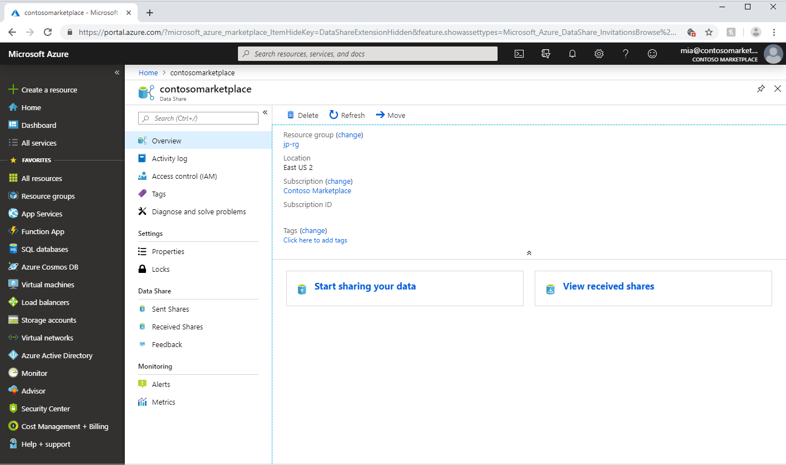
2. Select **Start sharing your data**.
3. Select **Create**.
4. Fill out the details for your Data Share. Specify a name, description of share contents, and terms of use (optional).
5. Select **Continue**.
6. To add Datasets to your Data Share, select **Add Datasets**.
7. Select the dataset type that you would like to add.
8. Navigate to the object you would like to share and select **Add Datasets**.
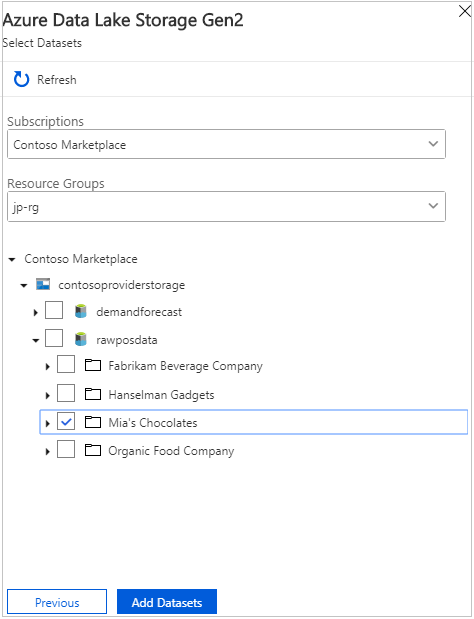
9. In the recipients tab, enter in the email address of your Data Consumer (the person sitting next to you) by select **+ Add Recipient**. You will need to ask for their Azure login e-mail address (not their alias e-mail address) due to some existing limitations. Provide them with your e-mail address too so that they can invite you to their data share. 
10. Optionally, if you want to see how an invitation looks, then add yourself as a recipient.
11. Select **Continue**.
12. Set a snapshot setting by checking the *Snapshot Schedule* box.
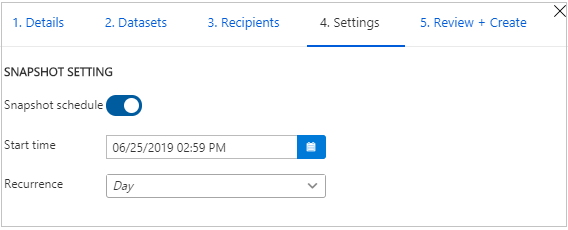
13. Select a start time 2-3 mins in the future and an hourly recurrence interval.
14. Select **Continue**.
15. In the *Review + Create* tab, review your Package Contents, Settings, Recipients, and Synchronization Settings.
16. Select **Create**.

## Consumer Instructions

Note: It's important that all the prerequisites are complete before accepting a data share invitation. (ie. Data Share Account must already be created & owner of storage account)

Sign into the Azure portal

1. Sign into the [Azure portal](https://portal.azure.com/#home).

Locate the invitation that was sent to you by the Data Provider

1. Check your inbox for an invitation from your data provider. The invitation is from Microsoft Azure, titled Azure Data Share invitation from <yourdataprovider@domain.com>. Take note of the share name to ensure you're accepting the correct share.
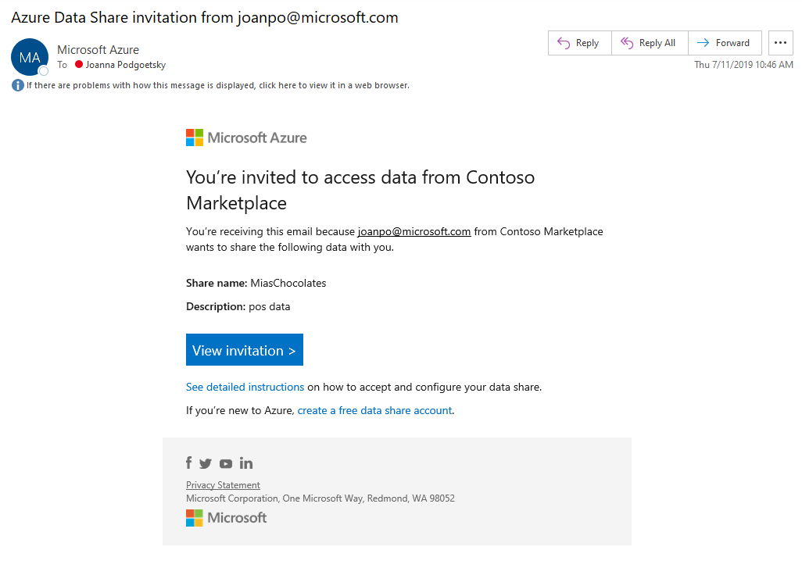
2. Select **View invitation** to see your invitation in Azure. This takes you to your *Received Shares* view.
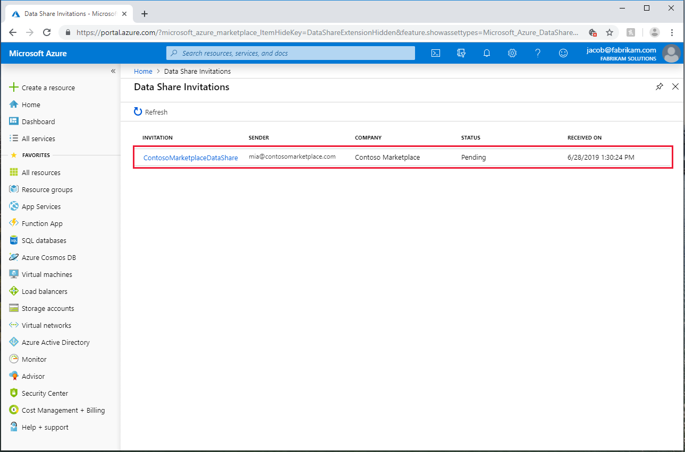
3. Select the invitation you would like to view.

Accept the invitation

1. Make sure all fields are reviewed, including the **Terms of use**. If you agree to the terms of use, you'll be required to check the box to indicate you agree.
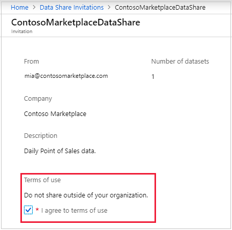
2. Under *Target Data Share Account*, select the subscription and resource group that you'll be deploying your Data Share into.
3. For the *Data Share Account* field, select **Create New** if you don't have an existing Data Share account. Otherwise, select an existing Data Share account that you'd like to accept your data share into.
4. For the *Received Share Name* field, you may leave the default specified by the Data Provider or specify a new name for the received share.
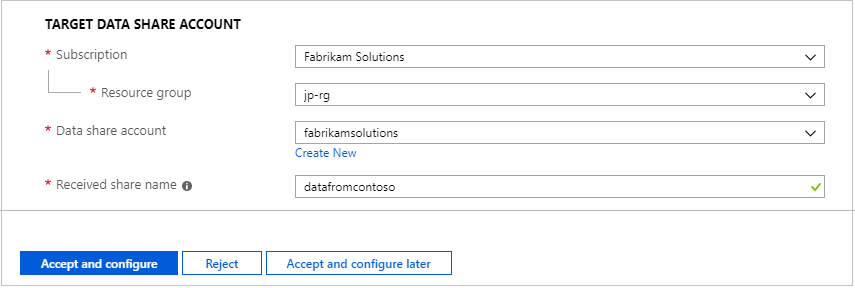
5. Once you've agreed to the terms of use and specified a location for your share, select **Accept and Configure**. If you choose this option, then a share subscription will be created and the next screen will ask you to select a target storage account for your data to be copied into.
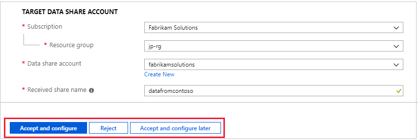
Configure target storage for your Data Share
1. Under *Target Storage Settings*, select the subscription, resource group, and storage account that you'd like to receive your data into.
Important: for the file system/container name, be sure to specify a name that differs from the name of the data share you specified as a data provider. 
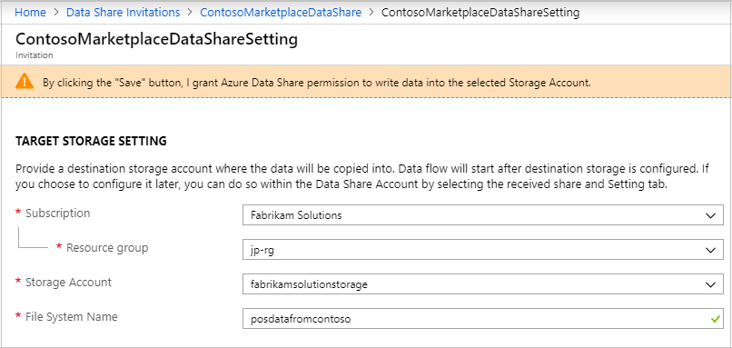
2. To receive regular refreshes of your data, make sure you enable the snapshot settings. Note that you will only see a snapshot schedule if your data provider has included it in the data share.
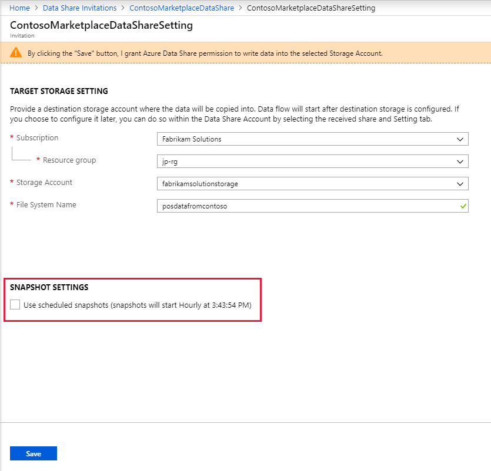
3. Select **Save**.
4. You can view the datasets you received in the *Received Shares -> Datasets* tab. If any of the datasets are unmapped then follow the instructions [here](https://docs.microsoft.com/en-us/azure/data-share/how-to-configure-mapping) to map them.
5. Ensure that you have set yourself as the owner of the storage account you want to receive data into. If you haven't, then refer to the prerequisites.

Trigger a snapshot

1. You can trigger a snapshot in the *Received Shares -> Details* tab by selecting **Trigger snapshot**. Here, you can trigger a full or incremental snapshot of your data. If it is your first-time receiving data from your data provider, select *Full Copy*.
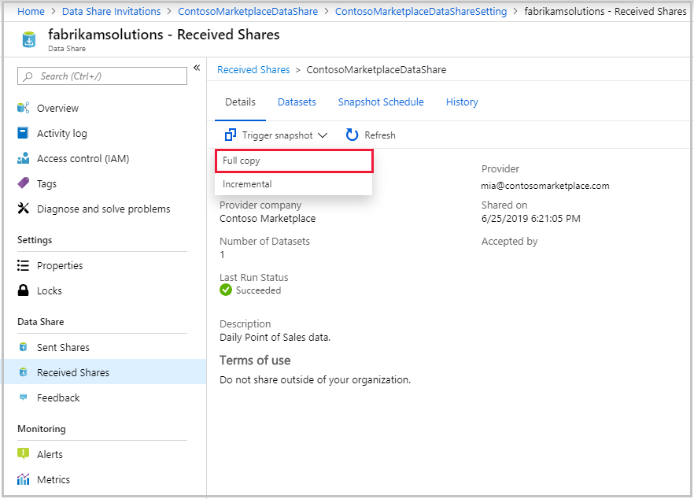
2. Navigate to the *Received Shares -> History* tab to monitor the progress of any runs. Select the current run to view progress of the dataset level runs.
3. When the last run status is *successful*, open the storage account to view the received data. To check which storage account you used, navigate to the *Received Shares -> Datasets* tab.
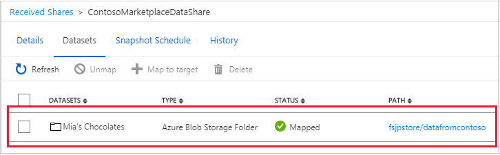

View a history of your snapshots

1. To view a history of your snapshots, navigate to the *Received Shares -> History* tab. Here you'll find a history of all snapshots that were generated for the past 60 days.
